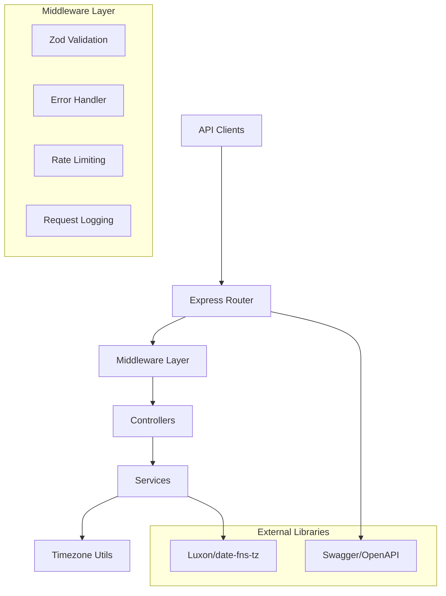

# Design Document

## Overview

The Timezone API Server is a Node.js (v20+) RESTful service that provides timezone conversion and current time retrieval functionality. The architecture follows a layered approach with clear separation of concerns, utilizing modern Node.js patterns and libraries for robust timezone handling, input validation, and API documentation.

## Architecture

### High-Level Architecture



### Technology Stack

- **Runtime**: Node.js v20+
- **Framework**: Express.js
- **Validation**: Zod
- **Timezone Handling**: Luxon (primary choice for robust timezone support)
- **Documentation**: Swagger/OpenAPI with swagger-ui-express
- **Containerization**: Docker with multi-stage builds
- **Orchestration**: Docker Compose

## Components and Interfaces

### API Endpoints

#### 1. Current Time Endpoint
- **Path**: `GET /api/time/current/{timezone}`
- **Purpose**: Retrieve current time in specified timezone
- **Input**: Timezone identifier (e.g., "America/New_York", "Europe/London")
- **Output**: JSON with current time, timezone info, and UTC offset

#### 2. Time Conversion Endpoint
- **Path**: `POST /api/time/convert`
- **Purpose**: Convert time from source timezone to target timezone
- **Input**: JSON body with sourceTime, sourceTimezone, targetTimezone
- **Output**: JSON with original and converted time information

#### 3. Documentation Endpoint
- **Path**: `GET /api/docs`
- **Purpose**: Serve interactive Swagger UI documentation

#### 4. Health Check Endpoint
- **Path**: `GET /health`
- **Purpose**: Service health and status monitoring

### Core Services

#### TimezoneService
```typescript
interface TimezoneService {
  getCurrentTime(timezone: string): Promise<TimeResponse>
  convertTime(request: ConversionRequest): Promise<ConversionResponse>
  validateTimezone(timezone: string): boolean
  listSupportedTimezones(): string[]
}
```

#### ValidationService
```typescript
interface ValidationService {
  validateTimezoneParam(timezone: string): ValidationResult
  validateConversionRequest(request: unknown): ValidationResult
}
```

### Middleware Components

#### 1. Validation Middleware
- Zod schema validation for all endpoints
- Type-safe request processing
- Detailed error responses for validation failures

#### 2. Error Handling Middleware
- Centralized error processing
- Consistent error response format
- Security-conscious error messages (no internal details exposed)

#### 3. Rate Limiting Middleware
- Prevent API abuse
- Configurable limits per endpoint
- Graceful degradation under load

## Data Models

### Request/Response Schemas

#### Current Time Response
```typescript
interface TimeResponse {
  timestamp: string;        // ISO 8601 format
  timezone: string;         // IANA timezone identifier
  utcOffset: string;        // UTC offset (e.g., "+05:00")
  formatted: {
    date: string;           // Human-readable date
    time: string;           // Human-readable time
    full: string;           // Full formatted datetime
  };
}
```

#### Time Conversion Request
```typescript
interface ConversionRequest {
  sourceTime: string;       // ISO 8601 or flexible format
  sourceTimezone: string;   // IANA timezone identifier
  targetTimezone: string;   // IANA timezone identifier
}
```

#### Time Conversion Response
```typescript
interface ConversionResponse {
  original: {
    timestamp: string;
    timezone: string;
    formatted: string;
  };
  converted: {
    timestamp: string;
    timezone: string;
    formatted: string;
  };
  utcOffsetDifference: string;
}
```

#### Error Response
```typescript
interface ErrorResponse {
  error: {
    code: string;
    message: string;
    details?: ValidationError[];
    timestamp: string;
  };
}
```

### Zod Validation Schemas

#### Timezone Parameter Schema
```typescript
const timezoneParamSchema = z.object({
  timezone: z.string()
    .min(1, "Timezone is required")
    .refine(isValidTimezone, "Invalid timezone identifier")
});
```

#### Conversion Request Schema
```typescript
const conversionRequestSchema = z.object({
  sourceTime: z.string().datetime("Invalid datetime format"),
  sourceTimezone: z.string().refine(isValidTimezone, "Invalid source timezone"),
  targetTimezone: z.string().refine(isValidTimezone, "Invalid target timezone")
});
```

## Error Handling

### Error Categories

1. **Validation Errors (400)**
   - Invalid timezone identifiers
   - Malformed datetime strings
   - Missing required parameters

2. **Not Found Errors (404)**
   - Unknown API endpoints

3. **Rate Limit Errors (429)**
   - Too many requests from same client

4. **Server Errors (500)**
   - Internal processing failures
   - External service unavailability

### Error Response Strategy

- Consistent error response format across all endpoints
- Detailed validation errors for client debugging
- Generic server error messages to prevent information leakage
- Proper HTTP status codes for different error types
- Request correlation IDs for debugging

## Testing Strategy

### Unit Testing
- Service layer testing with mocked dependencies
- Validation schema testing with edge cases
- Utility function testing for timezone operations
- Error handling scenario testing

### Integration Testing
- Full API endpoint testing
- Middleware integration testing
- Database/external service integration testing
- Docker container functionality testing

### API Testing
- Swagger/OpenAPI specification validation
- Contract testing for API consumers
- Load testing for performance validation
- Security testing for common vulnerabilities

### Test Data Strategy
- Comprehensive timezone test cases (edge cases like DST transitions)
- Invalid input test scenarios
- Performance test scenarios with high load
- Error condition simulation

## Deployment Architecture

### Docker Configuration

#### Multi-stage Dockerfile
1. **Build Stage**: Install dependencies, compile TypeScript
2. **Production Stage**: Minimal runtime image with only production dependencies

#### Docker Compose Services
- **API Service**: Main application container
- **Health Monitoring**: Optional monitoring container
- **Reverse Proxy**: Optional nginx container for production

### Environment Configuration
- Environment-specific configuration files
- Secrets management for sensitive data
- Configurable logging levels
- Port and host configuration flexibility

### Deployment Considerations
- Health check endpoints for container orchestration
- Graceful shutdown handling
- Resource limits and requests
- Horizontal scaling capabilities
- Monitoring and observability hooks